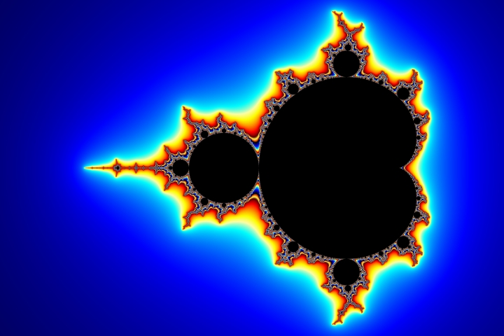
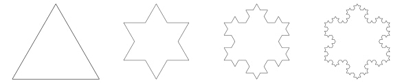

In this series, we explore everything about procedural generation. We’ll explore the basics, advanced, and state-of-the-art techniques, and discover how procedural generation is currently used in both content creation, and runtime interactive content.

## What is Procedural Generation?

Procedural generation (pcg, pc-gen or proc-gen for short) is the science, art, and technique of using _procedures_ (otherwise known as _algorithms_) to create data, typically through a combination of manually created content, computer-generated randomness, models and algorithms.[^1]

Modern pcg typically relies on deterministic [psuedorandom number generation](https://en.wikipedia.org/wiki/Pseudorandom_number_generator) (PRNG) to create reliable number sequences that can be used by downstream components to produce the exact same data for a given input. This ensures that if the user wants to generate the exact same data, all they need to do is use the exact same inputs.

### Where is it used?


  
  
  


Procedural generation's most public claim to fame mostly comes from the video games industry, where games like [Dwarf Fortress](https://www.bay12games.com/dwarves/), [Minecraft](https://www.minecraft.net/en-us) or [No Man's Sky](https://www.nomanssky.com/) have heavily relied on the art to produce the entire visible and interactible world for the player to explore.

However, procedural generation plays important roles in everyday life that typically goes unnotice by most individuals and sometimes even the implementors of the pcg systems themselves!

An incomplete list of less-known, but still widely used use-cases:

- **[Weather Forecasting](https://en.wikipedia.org/wiki/Weather_forecasting)**: Numerical weather prediction models like the Global Forecast System (GFS) developed by the National Centers for Environmental Prediction (NCEP) and the European Centre for Medium-Range Weather Forecasts (ECMWF) Integrated Forecast System (IFS) use procedural generation techniques to simulate atmospheric conditions and forecast weather.
- **[Computer-Aided Design (CAD)](https://en.wikipedia.org/wiki/Computer-aided_design)**: Popular CAD software like Autodesk AutoCAD, SolidWorks, and CATIA heavily utilize procedural modeling techniques for creating and modifying 3D models.[^2]
- **[Facial Animation and Lip-Syncing](https://en.wikipedia.org/wiki/Computer_facial_animation)**: Companies like Nvidia, Apple, and Microsoft have developed technologies like Nvidia FaceWorks, ARKit, and Microsoft Lip Sync that use procedural generation for facial animation and lip-syncing in various applications.[^3]
- **[Procedural Texture Generation](https://en.wikipedia.org/wiki/Procedural_texture)**: Game engines like Unreal Engine and Unity, as well as graphics software like Adobe Substance 3D, have tools and plugins for generating procedural textures.[^4]
- **[Data Visualization and Infographics](https://en.wikipedia.org/wiki/Data_and_information_visualization)**: Popular data visualization tools like Tableau, D3.js, and Infogram utilize procedural generation algorithms to create visualizations.[^5]
- **[Diffusion Models](https://en.wikipedia.org/wiki/Diffusion_model)**: Procedural generation is used to generate the seed noise for the denoising model.[^6]
- **[Architectural Design](https://en.wikipedia.org/wiki/Building_design)**: Procedural modeling is used to generate complex architectural structures, building facades, cityscapes, and urban environments based on defined rules and parameters. This allows architects and designers to rapidly explore numerous design variations.[^7] [^8] [^9]
- **[Landscape and Environment Generation](https://en.wikipedia.org/wiki/Scenery_generator)**: In visual effects for movies and TV, procedural techniques are employed to generate realistic landscapes, terrains, vegetation, clouds, and natural environments. This is particularly useful for creating expansive virtual worlds or depicting alien planets.[^10] [^11] [^12] [^13] [^14]
- **[Synthetic Data Generation](https://en.wikipedia.org/wiki/Synthetic_data)**: In fields like computer vision, machine learning, and autonomous systems, procedural generation is used to create large datasets of synthetic images, sensor data, or scenarios. This synthetic data can be used to train AI models when real-world data is scarce or difficult to obtain. [^15] [^16] [^17] [^18]
- **[Molecular Modeling](https://en.wikipedia.org/wiki/Molecular_modelling) & [Drug Design](https://en.wikipedia.org/wiki/Drug_design)**: In computational chemistry and biology, procedural methods are used to generate and analyze vast numbers of potential molecular structures and compounds. This is valuable for tasks like virtual screening and computer-aided drug design.
- **[Cybersecurity Testing](https://en.wikipedia.org/wiki/Penetration_test)**: Procedural generation techniques are utilized in cybersecurity to create large numbers of synthetic network traffic patterns, malware samples, or attack scenarios. These are used for testing and evaluating the robustness of security systems and intrusion detection algorithms.
- **[Software Testing](https://en.wikipedia.org/wiki/Fuzzing)**: Procedural generation in fuzzing allows for efficient exploration of the input space, increasing the chances of discovering vulnerabilities or edge cases that might be missed with manually created test cases. Tools like [American Fuzzy Lop (AFL)](https://github.com/google/AFL), [libFuzzer](https://llvm.org/docs/LibFuzzer.html), and [honggfuzz](https://github.com/google/honggfuzz) extensively leverage procedural generation for effective fuzzing.

## Humble Beginnings

Procedural generation has a briefer publicly famous history than most computing, with prominent uses seen in video games as far back as the late 1970's, where it was seen used in games like _Beneath Apple Manor_, _Rogue_, and _Maze Craze_.

However even before that, mathematicians such as Robert Brown (1773-1858), Norbert Wiener (1894-1964), Jean Perrin (1870–1942), Benoit Mandelbrot (1924–2010), and many others were hard at work observing fundamental stochastic processes and transforming them into algorithms.

They laid down the foundations that would be later used to create the stochastic algorithms we use today in almost all procedural generation.[^19]

- Robert Brown discovered the basis of Brownian Motion, which models the random movement of particles in a medium such as liquid or gas.
- Jean Perrin in collaboration with Godfrey Hardy were the first to transform Brownian Motion into an algorithm.
- Wiener expanded on Brownian Motion to add time as a parameter, in what is known as "Wiener process".
- Mandelbrot developed a "self-avoiding random walk" algorithm based on Wierner process.[^20]

[Fractals](https://en.wikipedia.org/wiki/Fractal) are another way of generating infinitely recursive repeating patterns. Their history is even longer than that of the infinitely repeating algorithms above. Fractals have been seen in architecture, pottery design, and drawings since early on in human history. It wouldn't see introduction into mathematics until the 17th century by Gottfried Leibniz, who pondered the mysteries of recursive self-similarity.

In the late 1800's, Karl Weierstrass and Georg Cantor contributed by discovering functions that could produce numbers on a line that would later be considered to be some of the first fractal sets (see [Cantor sets](https://en.wikipedia.org/wiki/Cantor_set)). Shortly after, Felix Klein and Henri Poincaré soon after discovered "self-inverse" fractals.

At the turn of the next century, in 1904, the famous [Koch snowflake](https://en.wikipedia.org/wiki/Koch_snowflake) was described by Helge von Koch. It is still used in many introductory texts and computer science classes to teach students how recursive algorithms can be used to create fractal patterns.

Nearly a century later in 1975, Mandelbrot became the first to visualize the [Mandelbrot set](https://en.wikipedia.org/wiki/Mandelbrot_set) originally drawn by Robert Brooks. This was the earliest known usage of computing technology to produce fractal images.

In 1980, Loren Carpenter introduced software for generating and rendering fractally generated landscapes,[^21] and from here on we see more and more complex systems and techniques built on top of these fundamental building blocks.

Today, we stand on the shoulders of these giants.

## The Many Techniques of Procedural Generation

Modern pcg relies on several techniques and algorithms, often combining them to create larger systems, more useful output, more constrained output, or anything in-between that the implementor has imagined.

Here is a (vastly) incomplete list:

1. **[Noise:](https://en.wikipedia.org/wiki/Gradient_noise)** Noise is a fundamental building block in procedural systems. Not only are there many ways of generating noise, but many kinds and categories of noise. It is quite common to layer, or combine layers of 2-dimensional noise and fractals to create more detailed or natural looking features and shapes.



2. **[Fractals:](https://en.wikipedia.org/wiki/Fractal)** Fractal algorithms, such as the Mandelbrot set and Julia sets, help create self-similar features and structural patterns at different scales. They are very commonly used in procedural terrain and world generation.



3. **[L-Systems:](https://en.wikipedia.org/wiki/L-system)** L-Systems, or Lindenmayer Systems, are parallel writing systems that use a set of rules to generate complex fractal-like structures. The are typically used to create foliage and organic structures.



4. **[Cellular Automata:](https://en.wikipedia.org/wiki/Cellular_automaton)** These are mathematical models that consist of a grid of cells, where the state of each cell evolves based on a set of rules and the states of its neighboring cells. They are commonly used for generating cave systems, terrain, and other structures with emergent behavior.



5. **[Wave Function Collapse:](https://en.wikipedia.org/wiki/Model_synthesis)** This is a relatively new technique that uses constraints and a wave function to generate coherent structures, such as dungeons, cities, or other complex environments, based on a set of input rules and sample data.



6. **[Machine Learning and AI:](https://en.wikipedia.org/wiki/Machine_learning)** Statistical models can be trained on existing data to generate new content that mimics the characteristics of the training data, such as text, images, sound, video, models, decisions, and a great variety of other useful data.



There are many, _many_ more techniques - such as evolutionary algorithms, grammar-based decision trees, parametric rendering, branching and cycling trees, markov chains, djikstra and tree maps, etc...

There are even more ways of combining these, and even more ideas about how systems can be built around them to produce incredible results. The possibilities are limitless, and vastly unexplored.

## What's Next

Next, we'll explore the basics of modern pcg by taking a deeper dive into pseudo-random number generators, noise generation, L-Systems, and space partitioning.

[^1]: <https://en.wikipedia.org/wiki/Procedural_generation>
[^2]: [Example: "Procedural modeling of Architecture" by Wonka et al. (2003)](https://dl.acm.org/doi/abs/10.1145/1185657.1185713)
[^3]: [Example: "Exploring Phonetic Context-Aware Lip-Sync For Talking Face Generation" by Park et al. (2023)](https://arxiv.org/abs/2305.19556)
[^4]: [Survey: "Survey of Procedural methods for Two-Dimensional Texture Generation" by Dong et al. (2020)](https://www.mdpi.com/1424-8220/20/4/1135)
[^5]: [Example: "Atlas: Grammar-based Procedural Generation of Data Visualizations" by Liu et al. (2021)](https://www.zcliu.org/atlas/Atlas_VIS2021.pdf)
[^6]: <https://en.wikipedia.org/wiki/Diffusion_model>
[^7]: [Example: "Procedural Generation for Architecture" by Artur Alkaim (2015)](https://web.ist.utl.pt/antonio.menezes.leitao/Rosetta/FinalReport/reports/ArturAlkaim-Report.pdf)
[^8]: [Example: "Declarative procedural generation of architecture with semantic architectural profiles" by Aanholt et al. (2020)](https://ieeexplore.ieee.org/abstract/document/9231561)
[^9]: [Survey: "A Survey of Procedural Techniques for City Generation" by Kelly, McCabe (2017)](https://arrow.tudublin.ie/itbj/vol7/iss2/5/)
[^10]: [Example: "Realtime procedural terrain generation", by Olsen (2004)](https://citeseerx.ist.psu.edu/document?repid=rep1&type=pdf&doi=5961c577478f21707dad53905362e0ec4e6ec644)
[^11]: [Survey: "Algorithms and approaches for procedural terrain generation-a brief review of current techniques" by Rose et al. (2016)](https://ieeexplore.ieee.org/abstract/document/7590336)
[^12]: [Example: "Procedural 3D terrain generation using generative adversarial networks" by Panagiotou et al. (2020)](https://www.academia.edu/download/82225523/2010.06411v1.pdf)
[^13]: [Example: "Terrain generation using procedural models based on hydrology" by Génevaux et al. (2013)](https://dl.acm.org/doi/abs/10.1145/2461912.2461996)
[^14]: [Review: "A Review of Digital Terrain Modeling" by Galin et al. (2019)](https://onlinelibrary.wiley.com/doi/abs/10.1111/cgf.13657)
[^15]: [Example: "Procedural Modeling and Physically Based Rendering for Synthetic Data Generation in Automotive Applications" by Tsirikoglou et al. (2017)](https://arxiv.org/abs/1710.06270)
[^16]: [Example: "ProcSy: Procedural Synthetic Dataset Generation Towards Influence Factor Studies Of Semantic Segmentation Networks" by Khan et al. (2019)](http://openaccess.thecvf.com/content_CVPRW_2019/papers/Vision%20for%20All%20Seasons%20Bad%20Weather%20and%20Nighttime/Khan_ProcSy_Procedural_Synthetic_Dataset_Generation_Towards_Influence_Factor_Studies_Of_CVPRW_2019_paper.pdf)
[^17]: [Example: "Procedural Generation of Synthetic Forest Environments to Train Machine Learning Algorithms" by Nunes, Oliveira (2021)](https://openreview.net/pdf?id=rpzgjNCe4G9)
[^18]: [Example: "Synthetic Data Generation for Steel Defect Detection and Classification Using Deep Learning" by Boikov et al. (2021)](https://www.mdpi.com/2073-8994/13/7/1176)
[^19]: [A Very Short History of Dynamicand Procedural Content Generation by Michael Blatz and Oliver Korn (2017)](https://www.researchgate.net/publication/315863952_A_Very_Short_History_of_Dynamic_and_Procedural_Content_Generation)
[^20]: [Wikipedia: Mandelbrot set](https://en.wikipedia.org/wiki/Mandelbrot_set)
[^21]: [Wikipedia: Fractal](https://en.wikipedia.org/wiki/Fractal)
