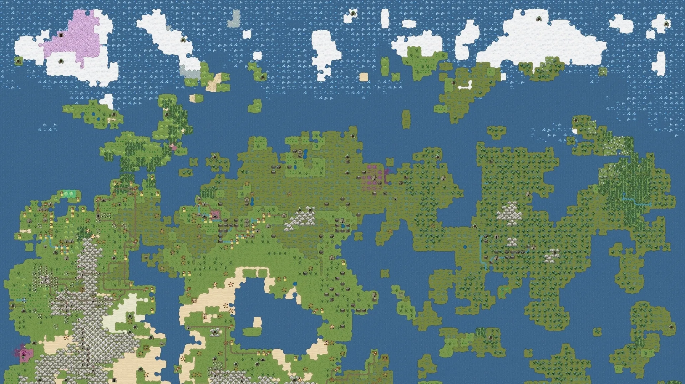
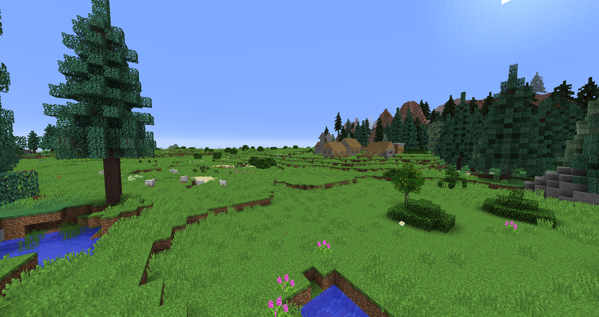

In this series, we explore everything about procedural generation. We’ll explore the basics, advanced, and state-of-the-art techniques, and discover how procedural generation is currently used in both content creation, and runtime interactive content.

## What is Procedural Generation?

Procedural generation (pc-gen or proc-gen for short) is the science, art, and technique of using _procedures_ (otherwise known as _algorithms_) to create data, typically through a combination of manually created content, computer-generated randomness, models and algorithms.[^1]

Procedural generation typically relies on deterministic [psuedorandom number generation](https://en.wikipedia.org/wiki/Pseudorandom_number_generator) (PRNG) to create reliable number sequences that can be used by downstream components to produce the exact same data for a given input. This ensures that if the user wants to generate the exact same data, all they need to do is use the exact same inputs. The trick is that the algorithms used in proc-gen tend to have high entropy, or "variability to the input", in their results; enabling a single number to drastically change the resulting output.

### Where is it used


  
  
  

<figcaption>From left to right: The map of Dwarf Fortress. A meadow biome in Minecraft. Gameplay of No Man's Sky. Images from various sources.</figcaption>

Procedural generation's most public claim to fame mostly comes from the video games industry, where games like [Dwarf Fortress](https://www.bay12games.com/dwarves/), [Minecraft](https://www.minecraft.net/en-us) or [No Man's Sky](https://www.nomanssky.com/) have heavily relied on the art to produce the entire visible and interactible world for the player to explore.

However, procedural generation plays important roles in everyday life that typically goes unnotice by most individuals and sometimes even the implementors of the proc-gen systems themselves!

A list of less-known, but still widely used use-cases:

- **[Weather Forecasting](https://en.wikipedia.org/wiki/Weather_forecasting)**: Numerical weather prediction models like the Global Forecast System (GFS) developed by the National Centers for Environmental Prediction (NCEP) and the European Centre for Medium-Range Weather Forecasts (ECMWF) Integrated Forecast System (IFS) use procedural generation techniques to simulate atmospheric conditions and forecast weather.
- **[Computer-Aided Design (CAD)](https://en.wikipedia.org/wiki/Computer-aided_design)**: Popular CAD software like Autodesk AutoCAD, SolidWorks, and CATIA heavily utilize procedural modeling techniques for creating and modifying 3D models.[^2]
- **[Facial Animation and Lip-Syncing](https://en.wikipedia.org/wiki/Computer_facial_animation)**: Companies like Nvidia, Apple, and Microsoft have developed technologies like Nvidia FaceWorks, ARKit, and Microsoft Lip Sync that use procedural generation for facial animation and lip-syncing in various applications.[^3]
- **[Procedural Texture Generation](https://en.wikipedia.org/wiki/Procedural_texture)**: Game engines like Unreal Engine and Unity, as well as graphics software like Adobe Substance 3D, have tools and plugins for generating procedural textures.[^4]
- **[Data Visualization and Infographics](https://en.wikipedia.org/wiki/Data_and_information_visualization)**: Popular data visualization tools like Tableau, D3.js, and Infogram utilize procedural generation algorithms to create visualizations.[^5]
- **[Diffusion Models](https://en.wikipedia.org/wiki/Diffusion_model)**: Procedural generation is used to generate the seed noise for the denoising model.[^6]
- **[Architectural Design](https://en.wikipedia.org/wiki/Building_design)**: Procedural modeling is used to generate complex architectural structures, building facades, cityscapes, and urban environments based on defined rules and parameters. This allows architects and designers to rapidly explore numerous design variations.[^7] [^8] [^9]
- **[Landscape and Environment Generation](https://en.wikipedia.org/wiki/Scenery_generator)**: In visual effects for movies and TV, procedural techniques are employed to generate realistic landscapes, terrains, vegetation, clouds, and natural environments. This is particularly useful for creating expansive virtual worlds or depicting alien planets.[^10] [^11] [^12] [^13] [^14]
- **[Synthetic Data Generation](https://en.wikipedia.org/wiki/Synthetic_data)**: In fields like computer vision, machine learning, and autonomous systems, procedural generation is used to create large datasets of synthetic images, sensor data, or scenarios. This synthetic data can be used to train AI models when real-world data is scarce or difficult to obtain. [^15] [^16] [^17] [^18]
- **[Molecular Modeling](https://en.wikipedia.org/wiki/Molecular_modelling) & [Drug Design](https://en.wikipedia.org/wiki/Drug_design)**: In computational chemistry and biology, procedural methods are used to generate and analyze vast numbers of potential molecular structures and compounds. This is valuable for tasks like virtual screening and computer-aided drug design.
- **[Cybersecurity Testing](https://en.wikipedia.org/wiki/Penetration_test)**: Procedural generation techniques are utilized in cybersecurity to create large numbers of synthetic network traffic patterns, malware samples, or attack scenarios. These are used for testing and evaluating the robustness of security systems and intrusion detection algorithms.
- **[Software Testing](https://en.wikipedia.org/wiki/Fuzzing)**: Procedural generation in fuzzing allows for efficient exploration of the input space, increasing the chances of discovering vulnerabilities or edge cases that might be missed with manually created test cases. Tools like [American Fuzzy Lop (AFL)](https://github.com/google/AFL), [libFuzzer](https://llvm.org/docs/LibFuzzer.html), and [honggfuzz](https://github.com/google/honggfuzz) extensively leverage procedural generation for effective fuzzing.

## Humble Beginnings

TODO: History

## The Many Techniques of Procedural Generation

TODO: Techniques

## A Brief Note on Noise

TODO: Noise

## What's Next

TODO: Next

[^1]: <https://en.wikipedia.org/wiki/Procedural_generation>
[^2]: [Example: "Procedural modeling of Architecture" by Wonka et al. (2003)](https://dl.acm.org/doi/abs/10.1145/1185657.1185713)
[^3]: [Example: "Exploring Phonetic Context-Aware Lip-Sync For Talking Face Generation" by Park et al. (2023)](https://arxiv.org/abs/2305.19556)
[^4]: [Survey: "Survey of Procedural methods for Two-Dimensional Texture Generation" by Dong et al. (2020)](https://www.mdpi.com/1424-8220/20/4/1135)
[^5]: [Example: "Atlas: Grammar-based Procedural Generation of Data Visualizations" by Liu et al. (2021)](https://www.zcliu.org/atlas/Atlas_VIS2021.pdf)
[^6]: <https://en.wikipedia.org/wiki/Diffusion_model>
[^7]: [Example: "Procedural Generation for Architecture" by Artur Alkaim (2015)](https://web.ist.utl.pt/antonio.menezes.leitao/Rosetta/FinalReport/reports/ArturAlkaim-Report.pdf)
[^8]: [Example: "Declarative procedural generation of architecture with semantic architectural profiles" by Aanholt et al. (2020)](https://ieeexplore.ieee.org/abstract/document/9231561)
[^9]: [Survey: "A Survey of Procedural Techniques for City Generation" by Kelly, McCabe (2017)](https://arrow.tudublin.ie/itbj/vol7/iss2/5/)
[^10]: [Example: "Realtime procedural terrain generation", by Olsen (2004)](https://citeseerx.ist.psu.edu/document?repid=rep1&type=pdf&doi=5961c577478f21707dad53905362e0ec4e6ec644)
[^11]: [Survey: "Algorithms and approaches for procedural terrain generation-a brief review of current techniques" by Rose et al. (2016)](https://ieeexplore.ieee.org/abstract/document/7590336)
[^12]: [Example: "Procedural 3D terrain generation using generative adversarial networks" by Panagiotou et al. (2020)](https://www.academia.edu/download/82225523/2010.06411v1.pdf)
[^13]: [Example: "Terrain generation using procedural models based on hydrology" by Génevaux et al. (2013)](https://dl.acm.org/doi/abs/10.1145/2461912.2461996)
[^14]: [Review: "A Review of Digital Terrain Modeling" by Galin et al. (2019)](https://onlinelibrary.wiley.com/doi/abs/10.1111/cgf.13657)
[^15]: [Example: "Procedural Modeling and Physically Based Rendering for Synthetic Data Generation in Automotive Applications" by Tsirikoglou et al. (2017)](https://arxiv.org/abs/1710.06270)
[^16]: [Example: "ProcSy: Procedural Synthetic Dataset Generation Towards Influence Factor Studies Of Semantic Segmentation Networks" by Khan et al. (2019)](http://openaccess.thecvf.com/content_CVPRW_2019/papers/Vision%20for%20All%20Seasons%20Bad%20Weather%20and%20Nighttime/Khan_ProcSy_Procedural_Synthetic_Dataset_Generation_Towards_Influence_Factor_Studies_Of_CVPRW_2019_paper.pdf)
[^17]: [Example: "Procedural Generation of Synthetic Forest Environments to Train Machine Learning Algorithms" by Nunes, Oliveira (2021)](https://openreview.net/pdf?id=rpzgjNCe4G9)
[^18]: [Example: "Synthetic Data Generation for Steel Defect Detection and Classification Using Deep Learning" by Boikov et al. (2021)](https://www.mdpi.com/2073-8994/13/7/1176)
